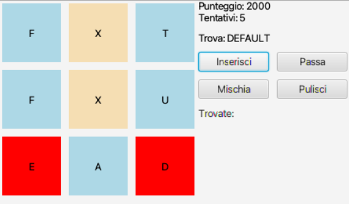
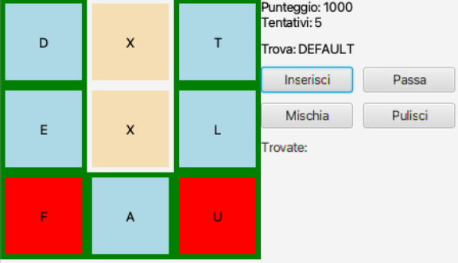
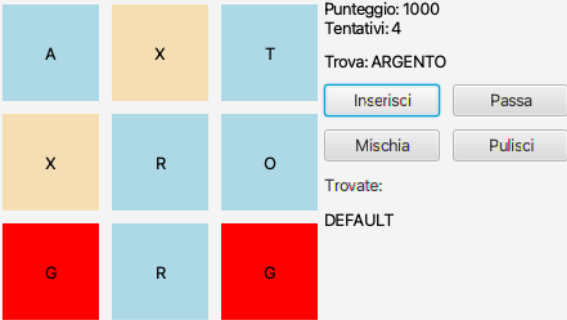

## Find the word!
JavaFX word puzzle Game developed for the Programming 2 course offered by University of Trento in 2022/2023.

Players must form a given word by selecting adjacent letters from a 3x3 grid. 
Each cell type behaves differently, challenging the player to strategize within limited attempts and score as many points as possible.

## Prerequisites
- Java Development Kit (JDK): version 19
- JavaFX SDK: version 17.0.6
- Suggested IDE: IntelliJ

## Results

  
  
  

## How to Play
Import the project in your IDE, configure JavaFX and run class `Main`
